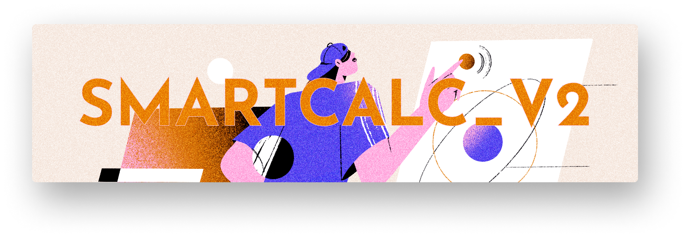
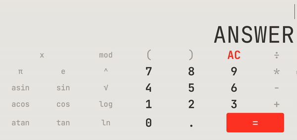

 

HOW TO BUILD:
=============================
#### - If you have a mac you can just run the file smartCalc_V2
#### - Can be opened in Qt creator
#### - Take advantage MAKEFILE

DOCUMENTATION SMARTCALC\_V2.0
=============================

LET'S GO!
---------

**SMARTCALC\_V2.0** - this is a convenient utility, which consists of two blocks, will help you calculate your any expressions and calculate the interest on the loan

#### Example:
 

1.  **Smart calculator** - is an application that allows you to calculate basic arithmetic operations and build graphs
2.  **Credit calculator** - is an application that allows you to calculate annuity and differentiated credit

### SMART CALCULATOR

**Smart calculator** - the program, which is a multifunctional calculator, includes many mathematical functions.

#### Basic Calculator Functions:

*   addition - **"+"**
*   subtraction - **"-"**
*   division - **"/"**
*   multiplication - **"\*"**

#### ADVANCED FEATURES:

*   exponentiation - **"^"**
*   taking the root of a number - **"√"**
*   calculating a value from a number **"cos()"**, **"sin()"** and **"tan()"**
*   calculating a value from a number **"acos()"**, **"asin()"** and **"atan()"**
*   calculating a value from a number **"log()"** and **"ln()"**

#### HOW TO USE:

1.  All buttons on the screen are active
2.  To calculate the expression, you need to click on the button **"="**
3.  To drawe plot, you need to click on the button **"x"** and **"="**
4.  In the graph window, you can change the scale by clicking on the **"+"** or **"-"** buttons.
5.  The error is always **"0"**

#### RECOMENDATION:

1.  Don't enter invalid values. Exmple: cos()
2.  Don't plot on a huge scale
3.  It is not advisable to combine several charts

### CREDIT CALCULATOR

**Credit calculator** - the program, Allows you to easily and quickly calculate the payment schedule for the planned loan or loan in order to assess your ability to fulfill obligations and repay the debt

#### TYPES OF CREDITS:

1.  **"Annuity"** - with annuity payments during the entire repayment period, the amount of monthly payments is the same, while in the initial period, debt repayment is slower, since accrued interest on the loan has to be paid. This type of loans is most common in Russia
2.  **"Differentiated"** - payment scheme involves, at the initial stage, the payment of large monthly amounts, which will become smaller with each subsequent time. The debt is repaid in equal installments over the entire period, but the amount of accrued interest changes

#### HOW TO USE:

1.  Enter values in fields: **"total credit amount"**, **"term"** and **"interest rate"**
2.  To calculate the expression, you need to click on the button **"RESULT"**
3.  The answer appears: **"monthly payment"**, **"overpayment on credit"** and **"total payment"**
4.  The error is always **"ERROR"**

#### RECOMENDATION:

*   Don't enter invalid values. Exmple: term: -1221312
*   maximum value of years = 55
*   maximum value of total credit amount = 1E9

### MENU

#### HOW TO USE:

1.  The window is on top
2.  Switching between windows happens on their pressing
3.  Closing occurs by pressing the **exit** button
4.  The error is always **"ERROR"**

BY V.A. GAIDENKO
